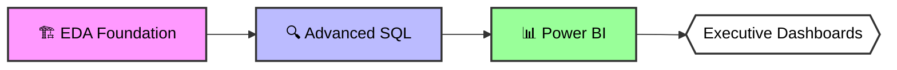

# Equipment Company Analytics Suite 🚀


-lightgrey)



## 📌 Project Evolution
### Phase 1: Exploratory Data Analysis

• Data profiling and quality assessment

• Basic business metrics

• Foundational insights

All these steps in [EDA Equipment Company Anlysis ](https://github.com/iirama/EDA-Equipment-store)

### Phase 2: Advanced Analytics
#### performance Analysis
• analyze the yearly performance of product by comparing thier sales to both the average sales performance of product and previous year sales


#### Part of whole Analysis
• the categories contribute the most to overall sales
   


#### Date Segmentation Analysis
• segment product into cost ranges and count how many products fall into each seqment


• Group customers based into three segments based on thier spending behavor: vip  , regular , new
 and the total number of customer by each group 


#### Change over time Analysis
• change over year
   


• change over month
   


• change over months in each year


#### Cumulative Analysis
• Calculate the total sales per month and running total of sales over time


   
• Calculate the total sales per year and running total of sales over time


#### Final:
• Build customer report (with handle with all data issues)

• Build product report  (with handle with all data issues)

• Build order report to link product and customer togather 

#### Screenshot Of Customer Report


#### Screenshot Of Customer Report


#### Screenshot Of order Report


### Phase 3: Power BI Integration
• Interactive visualizations

#### Screenshot of Fimga prototype dashboard background


#### Screenshot of PowerBI dashboard


#### Brief vidoeo of Power BI dashboard 
https://github.com/user-attachments/assets/87555385-92bc-4c89-b1b8-6c6313bfcad6

## 📊 Key Business Insights & Strategic Actions


### 🚴 Product Performance

````mermaid
pie
    title Revenue Distribution (2010-2014)
    "Bikes" : 96.5
    "Accessories" : 2.4
    "Clothing" : 1.1
````
##### 🚴 Bike Dominance: 96.5% of total revenue suggests:

1. Opportunity to expand premium bike offerings.
2. Risk of over-reliance on single category.

#### 🧰 Accessory Potential: Just 2.4% share indicates:

1. Need for bundling strategies.
2. Potential to increase $38 AOV.

#### 👕 Clothing Review: 1.1% contribution warrants:

1. Inventory optimization.
2. Potential category exit strategy.
   
#### Top Performers:

1. Mountain-200 Black-48 ($1.96M).
2. Road-250 Red-48 ($0.39M).

#### Action Plan:

1. Expand Mountain-200 inventory.
2. Develop bike+accessory bundles to boost cross-category sales.
3. Conduct pricing experiments on accessories.
4. Evaluate clothing line profitability.

### 💎 Customer Value

1. VIPs (1653 from total customer ) drive 36% of revenue $10,76m.
2. New (14.6k3 from total customer ) drive 38% of revenue $11,09m.
3. Regular (2200 from total customer ) drive 25% of revenue $7,5m.

#### Strategic Focus:

1. Exclusive VIP maintenance packages.
2. New customer onboarding incentives.

### 📅 Seasonal Trends

1. Best Quarter: Q2 (Spring/Winter) +22% vs average.
2. Peak Year: 2013 ($16.34m revenue).

#### Optimization:

1. Align marketing with seasonal demand.
2. Investigate 2013 peak reason.

### 🌎 Geographic Focus

1. US & Australia: 62% of revenue ($18.3M).
   
#### Growth Opportunity:

1. Localized US & Australia campaigns.
2. Targeted promotions for top regions.

## 📊 Dashboard Source: [Power BI Report ](https://github.com/iirama/Equipment-Store-Advanced-Analysis/blob/main/EUQ%20DASHBOARD.pbix)


